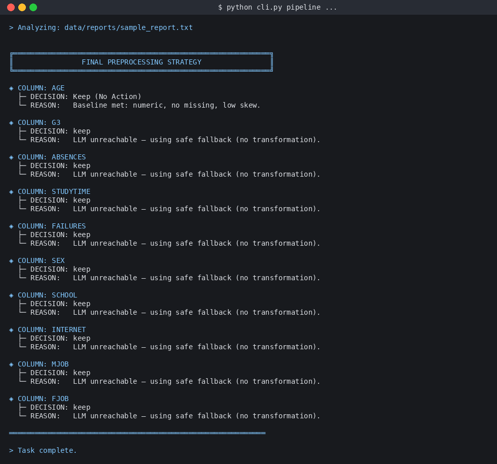
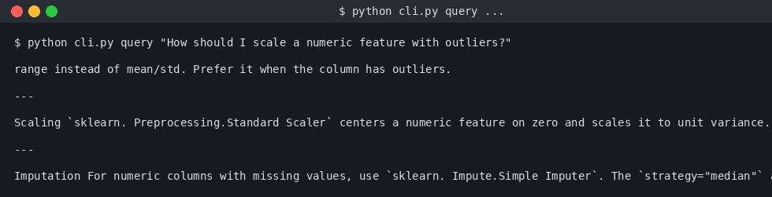
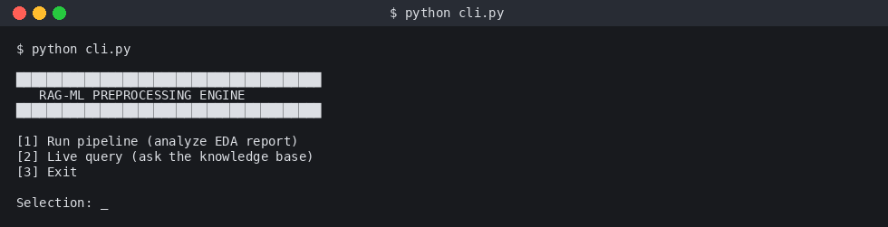

# RAG-ML Preprocessing Engine

A retrieval-augmented agent that reads an EDA report, decides the right
**scikit-learn preprocessing step for every column**, and answers free-form
questions about preprocessing. It runs **entirely on the command line** with
graceful fallbacks so the demo works even when no LLM is available.

| Mode | Command |
|---|---|
| Pipeline | `python cli.py pipeline data/reports/sample_report.txt` |
| Live query | `python cli.py query "How do I scale skewed numeric data?"` |
| Interactive menu | `python cli.py` |

## Demo

The demo below was generated by the bundled `docs/render_demos.py` script,
which calls the real CLI and rasterises the actual output — so what you see
is what you'll get when you run the project yourself.

### Pipeline run on a real EDA report


### Free-form question against the bundled knowledge base


### Interactive menu


To re-render after you change anything:

```bash
LD_PRELOAD=/lib/x86_64-linux-gnu/libstdc++.so.6 python docs/render_demos.py
```

---

## Why this project exists

When you hand an EDA report to a vanilla LLM and ask *"what should I do with
this column?"*, three things go wrong:

1. The model **hallucinates** transformer names that don't exist in sklearn.
2. The model picks a transformer that is **wrong for the dtype** (e.g.
   `OneHotEncoder` on a numeric).
3. The model recommends a step you **don't actually need** (e.g. scaling a
   column that's already normal and has no missing values).

This project layers **retrieval** plus a **5-stage critic** on top of the LLM
so the final recommendation is grounded in real sklearn documentation and
sanitised before it reaches the user.

---

## RAG features

- **FAISS vector index** over a Markdown knowledge base
  (`data/knowledge/sklearn_basics.md`), embedded with `BAAI/bge-small-en-v1.5`
  via `sentence-transformers`.
- **Two-stage retrieval**: dense top-`k` from FAISS, then a deterministic
  re-rank that **promotes preprocessing docs** and **demotes model docs** so
  the LLM can't suggest `RandomForestRegressor` as a preprocessing step.
- **Lazy index build**: the index is built on first use and persisted to
  `storage/faiss.index` + `storage/docs.pkl`. Subsequent runs load instantly.
- **Pre-built index swap-in**: drop your own `faiss.index` and `docs.pkl`
  into the storage folder and the project will load them as-is —
  `is_knowledge_synced()` skips the rebuild whenever the artefacts already
  exist (handy when the source MD/PKL is grounded by your own pipeline).
- **Per-column reasoning**: each column from the EDA report becomes its own
  RAG query — the model sees only the chunks that matter for that column's
  dtype, missing rate, skew and cardinality.
- **Graceful LLM fallback**: if the local Ollama/Gemma3 server isn't running,
  the pipeline returns a safe `"keep / no transformation"` decision per
  column instead of crashing, and clearly labels the row as a fallback.

### Configuring the LLM

The project talks to Ollama over HTTP. Configure with environment variables:

| Variable | Default | Purpose |
|---|---|---|
| `OLLAMA_HOST` | `http://127.0.0.1:11434` | Ollama HTTP endpoint |
| `OLLAMA_MODEL` | `gemma3:1b` | Model tag to call |
| `LLM_GRACEFUL_FALLBACK` | `1` | When `1`, never raise on LLM errors |
| `MD_SOURCE` | `data/knowledge/sklearn_basics.md` | Markdown source file |
| `STORAGE_DIR` | `storage` | Where the FAISS index and pickled chunks live |

To run with your own Gemma3 server:

```bash
export OLLAMA_HOST=http://my-llm-host:11434
export OLLAMA_MODEL=gemma3:4b
python cli.py pipeline data/reports/sample_report.txt
```

To swap in your own grounded knowledge base:

```bash
cp my_grounded.md       data/knowledge/sklearn_basics.md
cp my_index.faiss       storage/faiss.index
cp my_chunks.pkl        storage/docs.pkl
python cli.py pipeline ...
```

---

## The 5-stage critic

Every per-column LLM suggestion is run through `rag/critic.review_decision`
before it reaches the final report. Layers are applied in order; an
intervention by any layer is recorded in the row's `reason` field.

| Layer | Purpose | Example block |
|---|---|---|
| **0 — Safety** | Strips dangerous patterns (shell metacharacters, `__import__`, code-fence escapes) from the model output. | LLM returns ``` `rm -rf /` ``` → critic redacts. |
| **1 — Model rejection** | Rejects names that are sklearn **estimators** rather than transformers. | LLM says `RandomForestRegressor` → critic falls back to `Keep`. |
| **2 — Type enforcement** | Ensures the chosen transformer matches the column dtype (numeric ↔ scaler/imputer, categorical ↔ encoder). | LLM says `OneHotEncoder` for `age` (int) → critic rewrites to `StandardScaler` (or `Keep`). |
| **3 — Doc filter** | Re-ranks retrieved chunks so preprocessing docs outrank model docs *before* the LLM ever sees them. | Top-3 docs by score: `[StandardScaler, RobustScaler, MinMaxScaler]`. |
| **4 — LLM validation** | A second short LLM call asks *"given these docs, is this decision sound?"* and may overrule. | LLM says `MinMaxScaler` but doc says outliers present → critic upgrades to `RobustScaler`. |
| **5 — Patch** | Writes the corrected decision and an audit trail back into the row dict. | `reason += " | Critic correction: RobustScaler"` |

Layers 0–2 are **deterministic** and need no LLM, so the critic still
strengthens the answer when the model is offline.

---

## Project layout

```
.
├── cli.py                       # argparse entrypoint + interactive menu
├── core/
│   ├── config.py                # env-driven defaults (Ollama/MD/storage)
│   ├── logger.py
│   └── ...
├── extractor/                   # EDA-report parsing helpers
├── rag/
│   ├── parser.py                # turns the EDA text into per-column dicts
│   ├── chunker.py               # splits the MD knowledge base
│   ├── knowledge.py             # builds/loads the FAISS index + pickle
│   ├── retriever.py             # top-k retrieval + re-rank
│   ├── reasoning.py             # LLM call w/ graceful fallback
│   ├── critic.py                # 5-stage validator (above)
│   ├── pipeline.py              # column-by-column orchestration
│   ├── query.py                 # free-form Q&A path
│   └── router.py                # decides pipeline vs query
├── data/
│   ├── knowledge/sklearn_basics.md   # bundled tiny KB (swap-in supported)
│   └── reports/sample_report.txt     # bundled demo EDA report
├── storage/                     # faiss.index + docs.pkl (auto-built)
├── tests/                       # 76 unit + integration tests
├── docs/
│   ├── render_demos.py          # rasterises real CLI output to PNG
│   └── img/*.png                # demo screenshots used in this README
├── context/                     # LLM-friendly code index (see below)
└── total_context/               # LLM-friendly code index (see below)
```

### AI-Ready Metadata (context/)

This project includes a built-in Context Engine to make the codebase "instantly readable" for LLM agents and developers:

High-Density Mapping: project_summary.json provides a one-shot map of all modules, dependencies, and public symbols.

Docstring Indexing: docstrings.txt allows an AI to understand function signatures and intent without wasting tokens on implementation logic.

Automated Refresh: The total_context/ scripts ensure that as the code evolves, the AI's "mental map" remains 100% accurate.

---

## AI-Native Development (Context Engineering)
This project is built to be LLM-friendly. Instead of forcing an AI agent to ingest the entire codebase (wasting tokens and losing precision), the context/ directory provides a high-density map of the system:

Token Efficiency: By providing docstrings.txt and project_summary.json, external LLMs can understand every function signature, parameter, and module dependency without reading a single line of implementation logic.

Precision Debugging: If there is an indentation error or a logic bug, an AI can use the Function Index to locate the exact file and line number, rather than "guessing" based on a raw file dump.

One-Shot Bootstrapping: A new model can "know" the entire 76-test architecture in under 2k tokens by reading the project_summary.json.

## Running the tests

```bash
LD_PRELOAD=/lib/x86_64-linux-gnu/libstdc++.so.6 python -m pytest tests/ -q
```

Expected: **76 passed**. The suite uses a `StubRetriever` fixture and
`LLM_GRACEFUL_FALLBACK=1` so it never touches the network.

The suite covers:

| File | What it covers |
|---|---|
| `test_parser.py`              | EDA-report → column-dict parsing (incl. `missing=`) |
| `test_chunker.py`             | Markdown chunking + clean-cut boundaries |
| `test_text_cleaner.py`        | Whitespace / punctuation normalisation |
| `test_query.py`               | Free-form Q&A path |
| `test_router.py`              | Pipeline vs query routing heuristic |
| `test_reasoning.py`           | LLM call + graceful fallback contract |
| `test_critic.py`              | All 5 critic layers + output parsing |
| `test_pipeline_integration.py`| End-to-end pipeline with stub retriever |
| `test_knowledge_integration.py`| Real FAISS build + persist + reload |

---

## Installation

```bash
pip install -r requirements.txt
```


---

## Optional: connect a local Gemma3

```bash
ollama pull gemma3:1b      # or gemma3:4b, gemma3:12b, ...
ollama serve               # starts http://127.0.0.1:11434
python cli.py pipeline data/reports/sample_report.txt
```

Without Ollama running, every per-column row is labelled
`"LLM unreachable — using safe fallback (no transformation)"` and the
deterministic critic layers (0–3) still apply.
